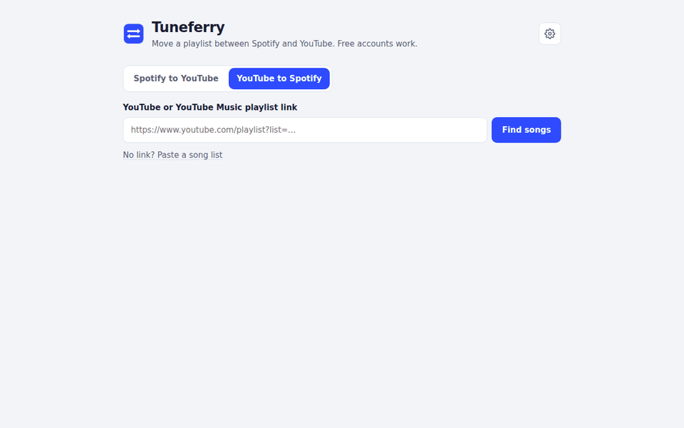

# Tuneferry

Move playlists between Spotify and YouTube, both ways, in a few clicks. A Chrome extension.

## What it does
- Paste a Spotify or YouTube playlist link, or click the icon on a playlist page
- Finds every song on the other service and shows how sure each match is
- You check the few flagged songs, then save the playlist
- Works with free accounts. No sign up, no server: everything runs in your browser

## How it's built
- **Chrome extension, Manifest V3**, plain JavaScript modules, no framework
- **Reading playlists**: reads the public page data for a playlist; for large or private lists it falls back to a small helper window that uses the user's own session
- **Matching**: a scoring system per song that weighs title words, artist, duration, official channels and penalizes covers, live versions, remixes, sped up versions and similar, unless the original song is that version
- **Speed**: songs are searched in batches with parallel requests, results are cached for 7 days, and the user can stop, retry only failed songs, or resume after closing the tab
- **Reliability**: every request has a timeout, temporary failures retry with growing waits, rate limits pause all workers together, and each step has a fallback path
- **Privacy by design**: no backend, no analytics, no data leaves the browser
- **Two builds from one codebase**: a developer build with diagnostics, and a store build where developer-only code is removed at build time and the build fails if any of it leaks

## Status
Submitted to the Chrome Web Store. Apple Music and more services planned.

Not made by, endorsed by, or connected to Spotify or YouTube.

Source code is private.
